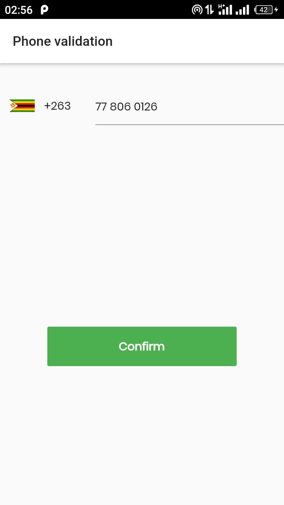
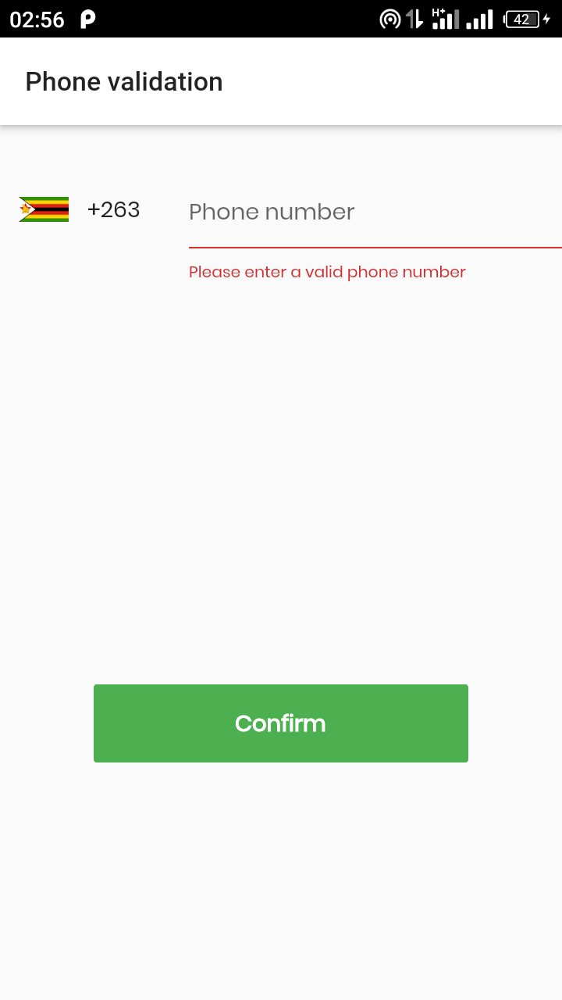
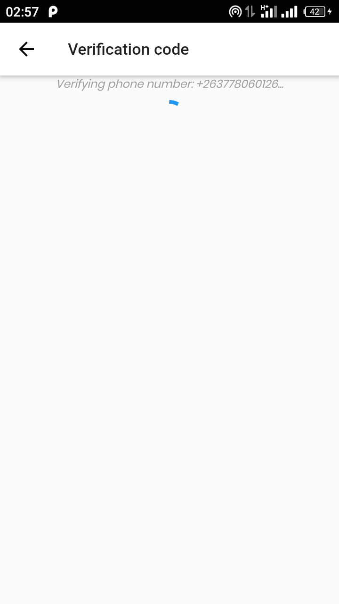
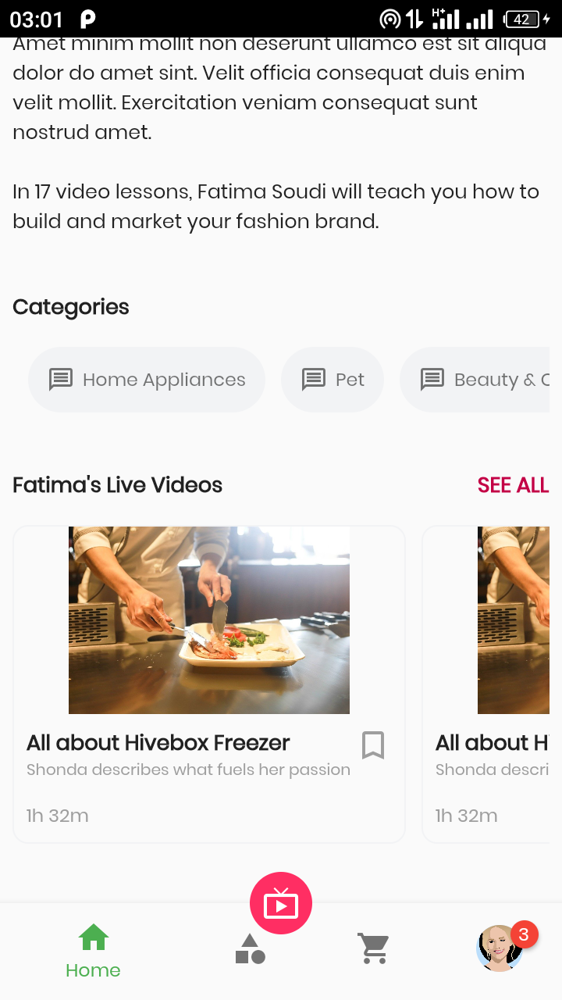
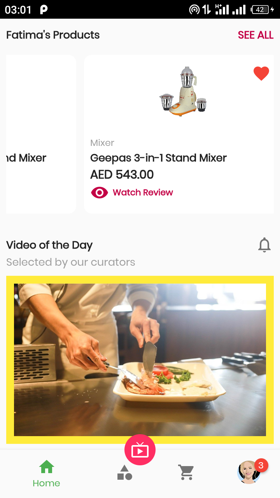

# assessment_app

## firebase phone-auth test number 
- Number: select zimbabwe and input `0778060126`
- code send: `123456`
  
## screenshots
### [demo design available here](demo/)
<table>
   <tr>
      <td> screenshot 1</td>
      <td> screenshot 2</td>
      <td> screenshot 3</td>
   </tr>
   <tr>
      <td>
      <td>
      <td>
   </tr>
</table>

- more
- <table>
   <tr>
      <td> screenshot 4</td>
      <td> screenshot 5</td>
      <td> screenshot 6</td>
      <td> screenshot 7</td>
   </tr>
   <tr>
      <td>
      <td>
      <td>
      <td>
   </tr>
</table>

A new Flutter project.

## Getting Started

This project is a starting point for a Flutter application.

A few resources to get you started if this is your first Flutter project:

- [Lab: Write your first Flutter app](https://flutter.dev/docs/get-started/codelab)
- [Cookbook: Useful Flutter samples](https://flutter.dev/docs/cookbook)

For help getting started with Flutter, view our
[online documentation](https://flutter.dev/docs), which offers tutorials,
samples, guidance on mobile development, and a full API reference.
